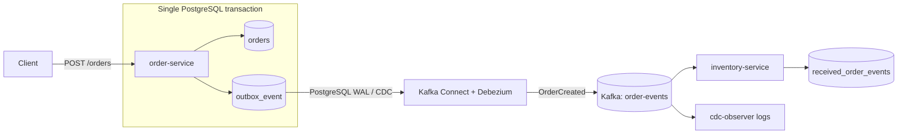

# Transactional Outbox Pattern with Quarkus

A small educational project that demonstrates the **Transactional Outbox Pattern** with Quarkus, PostgreSQL, Apache Kafka, Kafka Connect, and Debezium.

The most important rule in this project is:

> `order-service` never publishes `OrderCreated` directly to Kafka.

Creating an order writes only to PostgreSQL. The order row and the outbox row are created in the same database transaction. Debezium later observes the committed outbox insert through PostgreSQL Change Data Capture (CDC) and publishes the event to Kafka.

## Stack

- Java 21
- Maven
- Quarkus 3.38.3
- Quarkus REST + Jackson
- Hibernate ORM with Panache
- PostgreSQL
- Flyway
- Apache Kafka
- Quarkus Messaging Kafka
- Debezium 3.6.1.Final
- Debezium Quarkus Outbox
- Kafka Connect
- Docker Compose
- JUnit / QuarkusTest
- RestAssured
- Testcontainers
- Awaitility
- Maven Failsafe

## The problem Transactional Outbox solves

A tempting implementation is:

```java
saveOrder();
kafka.send(event);
```

Those are two independent operations against two different systems. A normal PostgreSQL transaction cannot make the database commit and Kafka publication atomic.

Two important failure windows exist:

1. The database commit succeeds and Kafka publication fails. The order exists, but downstream services never hear about it.
2. Kafka receives the event and the database transaction later fails. Downstream services receive an event for an order that does not exist.

Transactional Outbox changes the write path to:

```text
BEGIN
    INSERT order
    INSERT outbox_event
COMMIT
```

Only PostgreSQL participates in the transaction, so the order and outbox event either **both commit or both roll back**.

Debezium asynchronously reads the committed outbox change later and publishes it to Kafka. This avoids a distributed transaction while still making the application write durable and recoverable.

## Architecture



## Project structure

```text
01-transactional-outbox/
├── pom.xml
├── docker-compose.yml
├── README.md
├── .github/
│   └── workflows/
│       └── ci.yml
├── infrastructure/
│   ├── debezium/
│   │   └── register-order-outbox.json
│   └── postgres/
│       └── init-databases.sql
├── order-service/
│   ├── Dockerfile
│   ├── pom.xml
│   └── src/
│       ├── main/
│       │   ├── java/dev/pedro/outbox/order/
│       │   │   ├── api/
│       │   │   ├── domain/
│       │   │   ├── event/
│       │   │   └── service/
│       │   └── resources/
│       │       ├── application.properties
│       │       └── db/migration/V1__create_orders_and_outbox.sql
│       └── test/
│           └── java/dev/pedro/outbox/order/OrderResourceTest.java
├── inventory-service/
│   ├── Dockerfile
│   ├── pom.xml
│   └── src/main/
│       ├── java/dev/pedro/outbox/inventory/
│       │   ├── api/
│       │   ├── domain/
│       │   └── messaging/
│       └── resources/
│           ├── application.properties
│           └── db/migration/V1__create_received_events.sql
└── integration-tests/
    ├── pom.xml
    ├── docker-compose.e2e.yml
    ├── docker/
    │   ├── order-service.Dockerfile
    │   └── inventory-service.Dockerfile
    └── src/test/java/dev/pedro/outbox/e2e/
        └── TransactionalOutboxE2EIT.java
```

## Order model

`Order` contains:

- `id` - UUID
- `customerId` - UUID
- `total` - BigDecimal
- `status` - `CREATED`
- `createdAt` - timestamp

## OrderCreated event

The application event contains at least:

```json
{
  "eventId": "f6f228ba-ab49-47aa-860e-1e8dfbe39536",
  "eventType": "OrderCreated",
  "occurredAt": "2026-08-22T18:30:00Z",
  "orderId": "73f62edf-8fb6-4544-b59f-2043647ef3c8",
  "customerId": "3998401a-79a2-4673-a595-4336e21f2979",
  "total": 49.99
}
```

The Debezium Quarkus Outbox extension also creates its own technical UUID for `outbox_event.id`. The explicit `eventId` above is the application-level event identifier and is used by `inventory-service` for idempotency.

## Normal execution flow

1. A client calls `POST /orders`.
2. `OrderApplicationService.create()` runs inside a database transaction.
3. The order is inserted into `orders`.
4. The service fires an `OrderCreatedOutboxEvent` through Debezium Quarkus Outbox.
5. The extension inserts the event into `outbox_event` in the **same transaction**.
6. PostgreSQL commits both writes together.
7. Debezium reads the committed insert from PostgreSQL's WAL.
8. Debezium's Outbox Event Router transforms the row into the application event.
9. Kafka Connect publishes the event to `order-events`.
10. `inventory-service` consumes the Kafka record.
11. `inventory-service` stores it in `received_order_events`.

There is intentionally no Kafka producer in `order-service`.

## How Debezium CDC works here

PostgreSQL records committed changes in its **Write-Ahead Log (WAL)**. The PostgreSQL container enables logical replication:

```text
wal_level=logical
max_wal_senders=10
max_replication_slots=10
```

Kafka Connect runs the Debezium PostgreSQL connector defined in:

```text
infrastructure/debezium/register-order-outbox.json
```

It watches only:

```text
public.outbox_event
```

The important connector configuration is:

```json
{
  "table.include.list": "public.outbox_event",
  "transforms": "outbox",
  "transforms.outbox.type": "io.debezium.transforms.outbox.EventRouter",
  "transforms.outbox.table.expand.json.payload": "true",
  "transforms.outbox.route.topic.replacement": "order-events"
}
```

`table.expand.json.payload=true` converts the JSON string stored by the Quarkus Outbox extension back into a JSON Kafka value.

The aggregate ID is the order UUID, so Kafka uses the order ID as the record key. That is useful for preserving ordering between events belonging to the same aggregate.

## Why outbox rows remain visible

The learning project sets:

```properties
quarkus.debezium-outbox.remove-after-insert=false
```

That makes the outbox row easy to inspect during the normal and failure demonstrations. A production system would normally define a cleanup/retention strategy instead of letting the table grow indefinitely.

## Run everything manually

Prerequisite: Docker with Docker Compose V2.

```bash
docker compose up --build
```

Services:

| Service | Address |
| --- | --- |
| order-service | http://localhost:8080 |
| inventory-service | http://localhost:8081 |
| Kafka Connect / Debezium | http://localhost:8083 |
| PostgreSQL | localhost:5432 |
| Kafka | localhost:9092 |

The `debezium-init` container waits for Kafka Connect and `order-service`, then registers the connector automatically.

Check its status:

```bash
curl -s http://localhost:8083/connectors/order-outbox-connector/status
```

The connector and its task should both report `RUNNING`.

## Create and query an order

```bash
curl -i -X POST http://localhost:8080/orders \
  -H 'Content-Type: application/json' \
  -d '{
    "customerId": "11111111-1111-1111-1111-111111111111",
    "total": 49.99
  }'
```

Expected status:

```text
HTTP/1.1 201 Created
```

List orders:

```bash
curl -s http://localhost:8080/orders
```

Get a single order:

```bash
curl -s http://localhost:8080/orders/<order-id>
```

Inspect events processed by inventory:

```bash
curl -s http://localhost:8081/received-events
```

## Inspect PostgreSQL

Orders:

```bash
docker compose exec postgres \
  psql -U postgres -d orderdb \
  -c 'SELECT id, customer_id, total, status, created_at FROM orders ORDER BY created_at DESC;'
```

Outbox:

```bash
docker compose exec postgres \
  psql -U postgres -d orderdb \
  -c 'SELECT id, aggregatetype, aggregateid, type, timestamp, payload FROM outbox_event ORDER BY timestamp DESC;'
```

Inventory events:

```bash
docker compose exec postgres \
  psql -U postgres -d inventorydb \
  -c 'SELECT event_id, event_type, order_id, customer_id, total, occurred_at, received_at FROM received_order_events ORDER BY received_at DESC;'
```

## Inspect Kafka

List topics:

```bash
docker compose exec kafka \
  /kafka/bin/kafka-topics.sh \
  --bootstrap-server kafka:9092 \
  --list
```

Consume `order-events`:

```bash
docker compose exec kafka \
  /kafka/bin/kafka-console-consumer.sh \
  --bootstrap-server kafka:9092 \
  --topic order-events \
  --from-beginning \
  --property print.key=true \
  --property print.headers=true
```

The record key should be the order UUID and the value should contain the `OrderCreated` payload.

## Useful logs

Order write path:

```bash
docker compose logs -f order-service
```

Expected lines include:

```text
Order persisted orderId=...
Outbox event persisted eventId=... orderId=...
```

CDC/Kafka observation:

```bash
docker compose logs -f cdc-observer
```

Expected:

```text
Debezium captured event -> Kafka: <order-id> | { ... OrderCreated ... }
```

Inventory:

```bash
docker compose logs -f inventory-service
```

Expected:

```text
Kafka message received payload={...}
Inventory processed OrderCreated eventId=... orderId=...
```

## Failure demonstration: Kafka and Debezium unavailable

Start the complete system once so the connector and PostgreSQL replication slot exist:

```bash
docker compose up --build -d
```

Then stop the asynchronous infrastructure and consumer while leaving PostgreSQL and `order-service` running:

```bash
docker compose stop cdc-observer inventory-service connect kafka
```

Create an order:

```bash
curl -i -X POST http://localhost:8080/orders \
  -H 'Content-Type: application/json' \
  -d '{
    "customerId": "22222222-2222-2222-2222-222222222222",
    "total": 79.50
  }'
```

The request should still return `201 Created`. Kafka is not part of the HTTP request's database transaction.

Verify the order exists:

```bash
docker compose exec postgres \
  psql -U postgres -d orderdb \
  -c 'SELECT id, customer_id, total, status FROM orders ORDER BY created_at DESC LIMIT 5;'
```

Verify the outbox event exists:

```bash
docker compose exec postgres \
  psql -U postgres -d orderdb \
  -c 'SELECT id, aggregateid, type, timestamp, payload FROM outbox_event ORDER BY timestamp DESC LIMIT 5;'
```

Restore Kafka first, then Kafka Connect and inventory:

```bash
docker compose start kafka
docker compose start connect inventory-service cdc-observer
```

Watch recovery:

```bash
docker compose logs -f connect cdc-observer inventory-service
```

Debezium resumes CDC and the committed event eventually reaches inventory.

For this recovery experiment, use `docker compose stop` / `docker compose start`. Do not use `docker compose down -v` between the failure and recovery steps because `-v` destroys the state being demonstrated.

## Why this is safer than `saveOrder(); kafka.send(event);`

A direct dual write has no atomic boundary covering PostgreSQL and Kafka.

With the outbox pattern:

```text
BEGIN
  INSERT order
  INSERT outbox_event
COMMIT
```

If something fails before commit, PostgreSQL rolls both writes back. If Kafka is unavailable after commit, the committed outbox change is still durable and Debezium can deliver it later.

Delivery is asynchronous and should generally be treated as **at least once**, so consumers need idempotency. `inventory-service` uses the application `eventId` as its primary key and ignores events it has already processed.

## Tests

Run the existing normal Quarkus tests from the repository root:

```bash
mvn test
```

You can still run only the order-service tests:

```bash
cd order-service
mvn test
```

The existing tests remain unchanged and cover:

- creating an order persists the order
- creating an order creates an outbox row
- invalid requests return HTTP `400`
- forcing a rollback after both writes leaves neither an order nor an outbox event

Quarkus Dev Services uses a PostgreSQL test container, so Docker must be available for these tests.

## End-to-end integration test

The repository also contains a heavier integration test in `integration-tests/` that proves the complete infrastructure path rather than replacing components with mocks.

```text
POST /orders
    ->
PostgreSQL transaction
    ->
outbox_event
    ->
Debezium
    ->
Kafka
    ->
inventory-service
```

Run it from the repository root:

```bash
mvn verify -Pintegration
```

The `integration` Maven profile adds the `integration-tests` module. Maven builds `order-service` and `inventory-service` first. The integration test then uses Testcontainers' Docker Compose support to start an isolated PostgreSQL instance, Kafka, Kafka Connect/Debezium, and both built Quarkus services. You do **not** need to run the normal `docker-compose.yml` manually beforehand.

Docker and Docker Compose V2 must be available.

`TransactionalOutboxE2EIT.orderCreatedFlowsThroughOutboxDebeziumKafkaToInventory()`:

1. starts fresh infrastructure and both real services
2. cleans the order, outbox, and inventory tables
3. registers the existing Debezium connector automatically
4. calls the real `POST /orders` endpoint using a unique UUID
5. verifies the HTTP response is `201`
6. verifies the matching order exists in `orderdb`
7. verifies exactly one matching `outbox_event` exists and reads its real application `eventId`
8. reads the real `order-events` Kafka topic and verifies the `OrderCreated` event actually reached Kafka
9. uses Awaitility to poll until `inventory-service` stores exactly one matching event in `inventorydb`

The test never calls `OrderCreatedConsumer` directly and never publishes an event to Kafka itself. The only way it can pass is for the event to travel through:

```text
order-service
    -> PostgreSQL transaction
    -> outbox_event
    -> PostgreSQL logical decoding
    -> Debezium / Kafka Connect
    -> Kafka
    -> real inventory consumer
    -> inventory database
```

That makes this test significantly more valuable than a mocked Kafka test or a test that invokes the consumer method directly. A consumer-only test can validate business logic, but it cannot detect broken CDC configuration, a wrong outbox table name, an incorrect Debezium route, Kafka serialization problems, service wiring mistakes, or infrastructure startup issues. The E2E test verifies those boundaries together.

Because CDC and Kafka delivery are asynchronous, the test uses **Awaitility/eventual assertions** instead of arbitrary long `Thread.sleep` calls. Each execution starts a fresh Compose environment with fresh volumes and uses unique UUIDs, so it does not depend on a previous run or on a manually running stack.

## GitHub Actions

`.github/workflows/ci.yml` runs two jobs on pull requests and pushes to `main`:

```text
mvn -B test
mvn -B verify -Pintegration
```

The first job protects the existing fast Quarkus tests. The second job provides the heavier infrastructure proof with Docker available on the GitHub-hosted runner.

## Most important classes

### `OrderApplicationService`

The core transactional write boundary. Its `create()` method is `@Transactional`, persists the order, and fires the Debezium `ExportedEvent`. It never talks to Kafka.

### `OrderCreatedOutboxEvent`

Implements Debezium's `ExportedEvent<String, String>` contract and supplies the aggregate ID, aggregate type, event type, occurrence timestamp, and JSON payload.

### `OrderCreatedPayload`

The application event contract containing `eventId`, `eventType`, `occurredAt`, `orderId`, `customerId`, and `total`.

### `OrderCreatedConsumer`

Consumes `order-events` with Quarkus Messaging Kafka and stores the event in `received_order_events`. The `eventId` primary key provides basic idempotency for at-least-once delivery.

### `register-order-outbox.json`

Configures Debezium PostgreSQL CDC and the Outbox Event Router. This is the bridge from the PostgreSQL outbox to Kafka.

### `TransactionalOutboxE2EIT`

The infrastructure-level proof. It starts the real stack, registers Debezium, creates an order through HTTP, verifies PostgreSQL and Kafka directly, and waits for the real inventory consumer to persist the event.

## Things to experiment with

1. Stop only `inventory-service`, create several orders, restart it, and observe Kafka replay the unconsumed records.
2. Stop Kafka Connect while Kafka remains available, create orders, and observe Debezium catch up after restart.
3. Reset the Debezium connector/replication slot in a disposable environment and observe initial snapshot behavior.
4. Add a second event type such as `OrderCancelled` while keeping the same outbox table.
5. Add a second consumer to demonstrate Kafka fan-out.
6. Temporarily remove the inventory idempotency check in a disposable branch and explore duplicate delivery behavior.
7. Add an outbox cleanup policy and discuss when an outbox row is safe to delete.
8. Break the connector topic route deliberately and watch the E2E test catch the wiring error.

## Reset the manual demo completely

```bash
docker compose down -v
docker compose up --build
```

This removes the manual demo's PostgreSQL/Kafka volumes and starts again from a clean state.
