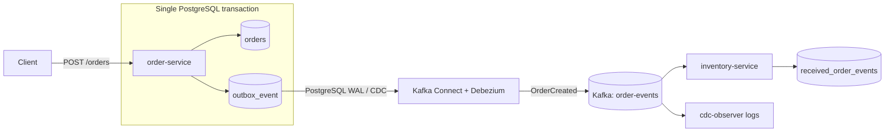

# Transactional Outbox Pattern with Quarkus

A small educational project that demonstrates the **Transactional Outbox Pattern** with Quarkus, PostgreSQL, Apache Kafka, Kafka Connect, and Debezium.

The important rule in this project is simple:

> `order-service` never publishes `OrderCreated` directly to Kafka.

Creating an order only writes to PostgreSQL. The order row and the outbox row are part of the same database transaction. Debezium later reads PostgreSQL's change stream and publishes the outbox event to Kafka.

## Stack

- Java 21
- Maven
- Quarkus 3.38.3
- Quarkus REST + Jackson
- Hibernate ORM with Panache
- PostgreSQL
- Flyway
- Apache Kafka
- Quarkus Messaging Kafka
- Debezium 3.6.1.Final
- Debezium Quarkus Outbox
- Kafka Connect
- Docker Compose
- JUnit / QuarkusTest
- RestAssured

## The problem Transactional Outbox solves

A tempting implementation is:

```java
saveOrder();
kafka.send(event);
```

Those are two independent operations against two different systems. A normal database transaction cannot make both operations atomic.

Two bad failure windows exist:

1. The database commit succeeds and the Kafka publish fails. The order exists, but downstream services never hear about it.
2. Kafka receives the event and the database transaction later fails. Downstream services receive an event for an order that does not exist.

The Transactional Outbox Pattern changes the write path to:

```text
Database transaction
    -> insert order
    -> insert outbox event
commit
```

Only PostgreSQL participates in that transaction, so either **both rows commit or neither row commits**.

Debezium then asynchronously observes the committed outbox insert through PostgreSQL Change Data Capture (CDC) and publishes it to Kafka.

This gives reliable asynchronous delivery without a distributed transaction between PostgreSQL and Kafka.

## Architecture



## Project structure

```text
01-transactional-outbox/
├── docker-compose.yml
├── README.md
├── infrastructure/
│   ├── debezium/
│   │   └── register-order-outbox.json
│   └── postgres/
│       └── init-databases.sql
├── order-service/
│   ├── Dockerfile
│   ├── pom.xml
│   └── src/
│       ├── main/
│       │   ├── java/dev/pedro/outbox/order/
│       │   │   ├── api/
│       │   │   │   ├── CreateOrderRequest.java
│       │   │   │   ├── OrderResource.java
│       │   │   │   └── OrderResponse.java
│       │   │   ├── domain/
│       │   │   │   ├── OrderEntity.java
│       │   │   │   ├── OrderRepository.java
│       │   │   │   └── OrderStatus.java
│       │   │   ├── event/
│       │   │   │   ├── OrderCreatedOutboxEvent.java
│       │   │   │   └── OrderCreatedPayload.java
│       │   │   └── service/
│       │   │       └── OrderApplicationService.java
│       │   └── resources/
│       │       ├── application.properties
│       │       └── db/migration/V1__create_orders_and_outbox.sql
│       └── test/
│           └── java/dev/pedro/outbox/order/OrderResourceTest.java
└── inventory-service/
    ├── Dockerfile
    ├── pom.xml
    └── src/main/
        ├── java/dev/pedro/outbox/inventory/
        │   ├── api/
        │   │   ├── ReceivedOrderEventResource.java
        │   │   └── ReceivedOrderEventResponse.java
        │   ├── domain/
        │   │   ├── ReceivedOrderEvent.java
        │   │   └── ReceivedOrderEventRepository.java
        │   └── messaging/
        │       ├── OrderCreatedConsumer.java
        │       └── OrderCreatedMessage.java
        └── resources/
            ├── application.properties
            └── db/migration/V1__create_received_events.sql
```

## Order model

`Order` contains:

- `id` - UUID
- `customerId` - UUID
- `total` - BigDecimal
- `status` - `CREATED`
- `createdAt` - timestamp

## OrderCreated event

The JSON payload contains:

```json
{
  "eventId": "f6f228ba-ab49-47aa-860e-1e8dfbe39536",
  "eventType": "OrderCreated",
  "occurredAt": "2026-08-22T18:30:00Z",
  "orderId": "73f62edf-8fb6-4544-b59f-2043647ef3c8",
  "customerId": "3998401a-79a2-4673-a595-4336e21f2979",
  "total": 49.99
}
```

The Debezium Outbox extension also creates its own outbox-row UUID in `outbox_event.id`. Debezium places that technical row/event ID in a Kafka header. The explicit `eventId` above is the application-level event identifier consumed by `inventory-service` and is used there for idempotency.

## Normal execution flow

1. A client calls `POST /orders`.
2. `OrderApplicationService.create()` starts a database transaction.
3. The order is inserted into `orders`.
4. The service fires `OrderCreatedOutboxEvent` through the Debezium Quarkus Outbox extension.
5. The extension inserts a row into `outbox_event` in the **same transaction**.
6. PostgreSQL commits both writes together.
7. Debezium reads the committed outbox insert from PostgreSQL's WAL.
8. Debezium's Outbox Event Router transforms the outbox record into the application event.
9. Kafka Connect publishes the payload to the `order-events` topic.
10. `inventory-service` consumes the Kafka record.
11. `inventory-service` stores it in `received_order_events`.

There is intentionally no Kafka producer in `order-service`.

## How Debezium CDC works here

PostgreSQL records committed changes in its **Write-Ahead Log (WAL)**.

The Compose PostgreSQL instance enables logical replication:

```text
wal_level=logical
max_wal_senders=10
max_replication_slots=10
```

Kafka Connect runs the Debezium PostgreSQL connector configured in:

```text
infrastructure/debezium/register-order-outbox.json
```

The connector watches only:

```text
public.outbox_event
```

The important connector settings are:

```json
{
  "table.include.list": "public.outbox_event",
  "transforms": "outbox",
  "transforms.outbox.type": "io.debezium.transforms.outbox.EventRouter",
  "transforms.outbox.table.expand.json.payload": "true",
  "transforms.outbox.route.topic.replacement": "order-events"
}
```

`table.expand.json.payload=true` converts the JSON string stored by the Quarkus Outbox extension back into a real JSON Kafka value.

The outbox aggregate ID is the order UUID, so Kafka uses the order ID as the record key. That helps preserve ordering for events belonging to the same order.

## Why the outbox rows remain in the table

This project sets:

```properties
quarkus.debezium-outbox.remove-after-insert=false
```

That is useful for learning because you can inspect the outbox row after creating an order and during failure experiments.

In a production system you would normally define a retention/cleanup strategy instead of allowing the table to grow forever.

## Run everything

Prerequisite: Docker with Docker Compose v2.

From this directory:

```bash
docker compose up --build
```

The first build downloads Maven dependencies and builds both Quarkus applications.

Services:

| Service | Address |
| --- | --- |
| order-service | http://localhost:8080 |
| inventory-service | http://localhost:8081 |
| Kafka Connect / Debezium | http://localhost:8083 |
| PostgreSQL | localhost:5432 |
| Kafka | localhost:9092 |

The `debezium-init` container automatically waits for Kafka Connect and `order-service`, then registers the connector.

Check connector status:

```bash
curl -s http://localhost:8083/connectors/order-outbox-connector/status
```

You want both the connector and its task to show `RUNNING`.

## Create an order

Generate a UUID if needed:

```bash
uuidgen
```

Create an order:

```bash
curl -i -X POST http://localhost:8080/orders \
  -H 'Content-Type: application/json' \
  -d '{
    "customerId": "11111111-1111-1111-1111-111111111111",
    "total": 49.99
  }'
```

Expected HTTP status:

```text
HTTP/1.1 201 Created
```

Example response:

```json
{
  "id": "73f62edf-8fb6-4544-b59f-2043647ef3c8",
  "customerId": "11111111-1111-1111-1111-111111111111",
  "total": 49.99,
  "status": "CREATED",
  "createdAt": "2026-08-22T18:30:00Z"
}
```

## Query orders

```bash
curl -s http://localhost:8080/orders
```

```bash
curl -s http://localhost:8080/orders/73f62edf-8fb6-4544-b59f-2043647ef3c8
```

## Query events processed by inventory-service

```bash
curl -s http://localhost:8081/received-events
```

## Inspect PostgreSQL directly

Orders:

```bash
docker compose exec postgres \
  psql -U postgres -d orderdb \
  -c 'SELECT id, customer_id, total, status, created_at FROM orders ORDER BY created_at DESC;'
```

Outbox:

```bash
docker compose exec postgres \
  psql -U postgres -d orderdb \
  -c 'SELECT id, aggregatetype, aggregateid, type, timestamp, payload FROM outbox_event ORDER BY timestamp DESC;'
```

Inventory's stored events:

```bash
docker compose exec postgres \
  psql -U postgres -d inventorydb \
  -c 'SELECT event_id, event_type, order_id, customer_id, total, occurred_at, received_at FROM received_order_events ORDER BY received_at DESC;'
```

## Inspect Kafka

List topics:

```bash
docker compose exec kafka \
  /kafka/bin/kafka-topics.sh \
  --bootstrap-server kafka:9092 \
  --list
```

Consume `order-events` from the beginning:

```bash
docker compose exec kafka \
  /kafka/bin/kafka-console-consumer.sh \
  --bootstrap-server kafka:9092 \
  --topic order-events \
  --from-beginning \
  --property print.key=true \
  --property print.headers=true
```

The record key should be the order UUID and the value should be the `OrderCreated` JSON payload.

## Useful logs

Watch the order write path:

```bash
docker compose logs -f order-service
```

Expected lines:

```text
Order persisted orderId=...
Outbox event persisted eventId=... orderId=...
```

Watch the CDC hop:

```bash
docker compose logs -f cdc-observer
```

Expected line:

```text
Debezium captured event -> Kafka: <order-id> | { ... OrderCreated ... }
```

`cdc-observer` is only an educational observer. It consumes the Kafka topic and makes the successful Debezium-to-Kafka hop obvious in the terminal.

Watch Kafka Connect itself:

```bash
docker compose logs -f connect
```

Watch inventory:

```bash
docker compose logs -f inventory-service
```

Expected lines:

```text
Kafka message received payload={...}
Inventory processed OrderCreated eventId=... orderId=...
```

## Failure demonstration: Kafka and Debezium unavailable

First start the complete system at least once so that the connector and PostgreSQL replication slot exist:

```bash
docker compose up --build -d
```

Verify:

```bash
curl -s http://localhost:8083/connectors/order-outbox-connector/status
```

Now stop the asynchronous infrastructure and consumer, but leave PostgreSQL and `order-service` running:

```bash
docker compose stop cdc-observer inventory-service connect kafka
```

Create an order while Kafka and Debezium are unavailable:

```bash
curl -i -X POST http://localhost:8080/orders \
  -H 'Content-Type: application/json' \
  -d '{
    "customerId": "22222222-2222-2222-2222-222222222222",
    "total": 79.50
  }'
```

The request should still return `201 Created` because `order-service` does not need Kafka to complete the database transaction.

Confirm the order exists:

```bash
docker compose exec postgres \
  psql -U postgres -d orderdb \
  -c 'SELECT id, customer_id, total, status FROM orders ORDER BY created_at DESC LIMIT 5;'
```

Confirm the outbox event also exists:

```bash
docker compose exec postgres \
  psql -U postgres -d orderdb \
  -c 'SELECT id, aggregateid, type, timestamp, payload FROM outbox_event ORDER BY timestamp DESC LIMIT 5;'
```

At this point there is no requirement for the Kafka message to have been delivered yet. The durable source of truth is PostgreSQL.

Restore Kafka first:

```bash
docker compose start kafka
```

Then restore Kafka Connect, inventory, and the observer:

```bash
docker compose start connect inventory-service cdc-observer
```

Watch the recovery:

```bash
docker compose logs -f connect cdc-observer inventory-service
```

Debezium resumes from its PostgreSQL replication position, publishes the missed outbox insert to Kafka, and `inventory-service` eventually stores it.

Confirm inventory received it:

```bash
curl -s http://localhost:8081/received-events
```

### Important for this experiment

Use `docker compose stop` / `docker compose start`.

Do **not** use:

```bash
docker compose down -v
```

`-v` deletes the PostgreSQL and Kafka volumes and therefore destroys the state that makes this recovery experiment meaningful.

## Why this is safer than `saveOrder(); kafka.send(event);`

With a direct dual write:

```text
saveOrder()
kafka.send(event)
```

there is no atomic boundary covering both PostgreSQL and Kafka.

The outbox version has one atomic boundary:

```text
BEGIN
  INSERT order
  INSERT outbox_event
COMMIT
```

If anything fails before commit, PostgreSQL rolls both writes back.

If Kafka is unavailable after commit, nothing is lost: the committed outbox change remains represented in PostgreSQL/WAL and Debezium can deliver it later.

The trade-off is that delivery is asynchronous and should normally be treated as **at least once**. Consumers therefore need idempotency. In this demo `inventory-service` uses `eventId` as the primary key and ignores an event it has already processed.

## Tests

Run the order-service tests:

```bash
cd order-service
mvn test
```

Quarkus Dev Services starts a PostgreSQL test container automatically, so Docker must be available.

The tests cover:

- creating an order persists the order
- creating an order creates an outbox row
- invalid requests return HTTP `400`
- forcing a rollback after both writes leaves neither an order nor an outbox event

The rollback test deliberately starts an outer transaction, calls the normal order creation service, throws an exception, and then verifies both tables are empty. There is no special production-only "failure endpoint" just for the test.

## Most important classes

### `OrderApplicationService`

The core of the pattern.

Its `create()` method is `@Transactional`, persists the order, and then fires an `ExportedEvent`. It never talks to Kafka.

That one method is the atomic write boundary for the order and outbox event.

### `OrderCreatedOutboxEvent`

Implements Debezium's `ExportedEvent<String, String>` contract.

It tells the Debezium Quarkus Outbox extension:

- aggregate ID: order UUID
- aggregate type: `orders`
- event type: `OrderCreated`
- timestamp: occurrence time
- payload: JSON `OrderCreated` document

### `OrderCreatedPayload`

The application event contract. It carries:

- `eventId`
- `eventType`
- `occurredAt`
- `orderId`
- `customerId`
- `total`

### `OrderResource`

Provides:

- `POST /orders`
- `GET /orders`
- `GET /orders/{id}`

Validation rejects missing customer IDs, missing totals, and totals below `0.01`.

### `OrderCreatedConsumer`

Consumes `order-events` using Quarkus Messaging Kafka.

It logs the raw Kafka message, deserializes `OrderCreated`, stores it in `received_order_events`, and uses `eventId` to make duplicate processing harmless.

### `register-order-outbox.json`

Defines the Debezium PostgreSQL connector and the Outbox Event Router transformation.

This is the bridge from PostgreSQL CDC to Kafka.

## Things to experiment with

1. Stop only `inventory-service`, create several orders, then restart it and observe Kafka replay the unconsumed records.
2. Stop Kafka Connect but leave Kafka running, create orders, and observe Debezium catch up after restart.
3. Create 10 events for the same order aggregate and inspect their Kafka keys and partition ordering.
4. Remove the idempotency check in `inventory-service`, reset the consumer offset, and observe duplicate inserts fail.
5. Add a second event type such as `OrderCancelled` and keep the same outbox table.
6. Change `transforms.outbox.route.topic.replacement` to use one topic per aggregate type.
7. Set `quarkus.debezium-outbox.remove-after-insert=true` and compare what remains visible in the outbox table.
8. Reset the Debezium connector/slot in a disposable environment and observe how an initial snapshot handles existing outbox rows.
9. Add a cleanup job that deletes outbox rows only after a safe retention period.
10. Add a second consumer service to demonstrate fan-out from the same Kafka event.

## Reset the demo completely

```bash
docker compose down -v
```

Then rebuild from a clean state:

```bash
docker compose up --build
```
